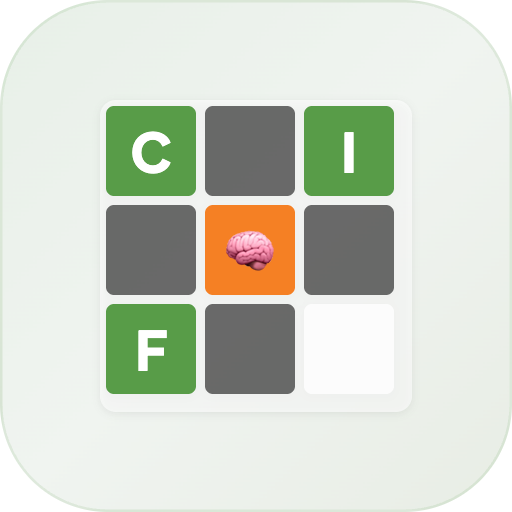
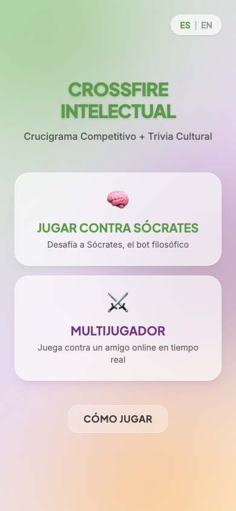
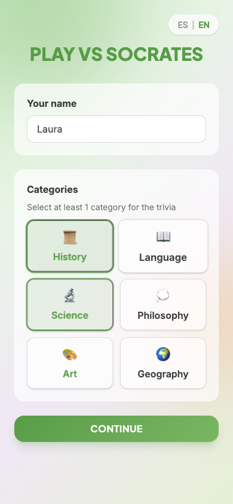
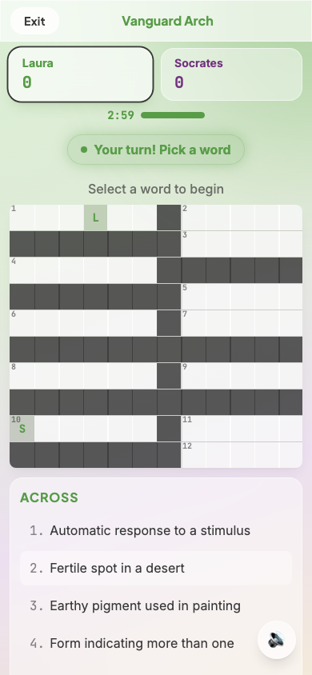

<p align="center">
  
</p>

<h1 align="center">Crossfire Intellectual</h1>

<p align="center">
  <strong>Competitive Crossword + Cultural Trivia</strong><br/>
  A turn-based multiplayer game that blends crossword puzzles with trivia questions across History, Science, Art, Philosophy, Geography, and Language.
</p>

<p align="center">
  
</p>

---

## How It Works

1. **Pick a word** from the crossword grid and fill in the letters
2. **Answer a trivia question** that appears after completing the word
3. **Score points** — correct answers earn double, hints cost points
4. **Race to 150 points** — take turns against a bot or a real opponent

<p align="center">
  
  &nbsp;&nbsp;
  
  &nbsp;&nbsp;
  
</p>

## Features

- **Solo mode** — Play against Socrates, a philosophical bot with 70% accuracy
- **Real-time multiplayer** — Create a room, share a 4-letter code, play head-to-head via Supabase Realtime
- **6 trivia categories** — History, Language, Science, Philosophy, Art, Geography
- **Bilingual** — Full support for English and Spanish (crosswords + questions + UI)
- **Installable PWA** — Works offline, add to home screen on any device
- **Mobile-first** — Designed for touch with haptic feedback, large targets, and responsive layout
- **Animated UI** — Glassmorphism, mesh gradients, Framer Motion transitions, and confetti on victory

## Tech Stack

| Layer | Technology |
|-------|-----------|
| **Framework** | React 18 + TypeScript |
| **Bundler** | Vite with code-splitting and lazy-loaded data |
| **Styling** | Tailwind CSS 4 with custom glassmorphism theme |
| **State** | Zustand (single store with session persistence) |
| **Multiplayer** | Supabase Realtime (broadcast + presence + DB sync) |
| **Animations** | Framer Motion |
| **Sound** | Howler.js |
| **i18n** | i18next with browser language detection |
| **PWA** | vite-plugin-pwa (Workbox service worker) |
| **Testing** | Playwright (E2E + multiplayer with dual browser contexts) |

## Getting Started

```bash
# Install dependencies
npm install

# Set up environment variables
cp .env.example .env.local
# Edit .env.local with your Supabase project URL and anon key

# Start development server
npm run dev

# Run tests
npm test
```

## Project Structure

```
src/
  components/     # React components (screens/ and ui/)
  hooks/          # Custom React hooks
  store/          # Zustand state management
  lib/            # Game logic, networking, bot, sound
  constants/      # Game configuration and scoring
  data/           # Crossword grids and trivia questions (EN + ES)
  i18n/           # Translation files
```

See [ARCHITECTURE.md](ARCHITECTURE.md) for detailed file listings, type contracts, and function signatures.

## Scripts

| Command | Description |
|---------|-------------|
| `npm run dev` | Start dev server |
| `npm run build` | Type-check and build for production |
| `npm test` | Run all Playwright E2E tests |
| `npm run test:multiplayer` | Run only multiplayer tests |
| `npm run test:ui` | Open Playwright test UI |
| `npm run preview` | Preview production build locally |
